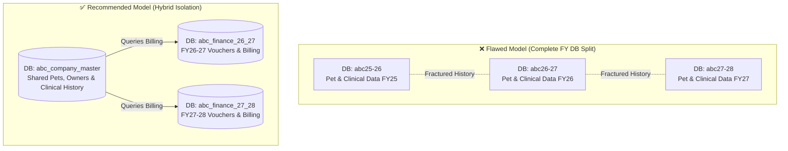

# 🐾 Pet Clinic ERP — Multi-Company Architecture & Pet Book Strategy
**Comprehensive Analysis, Architectural Correction, and Implementation Plan**

---

## 🏗️ PART 1: Company Creation & Multi-Database Strategy

### 1.1 The User's Proposed Model
* **Core Concept:** Allow customers to register up to 3 separate businesses/companies.
* **Database Mechanism:** Each company gets a separate database for each financial year (e.g., Company ABC gets `abc26-27`, Company BCD gets `bcd26-27`).
* **Goal:** Complete isolation of business accounts and financial year data.

---

### 1.2 ⚠️ CRITICAL ARCHITECTURAL FLAW ANALYSIS (What Was Missed / Planned Wrong)

While separating financial data by Financial Year (FY) is a standard accounting practice, **applying strict database per financial year isolation to an entire Veterinary ERP creates catastrophic clinical workflows.**



#### 🚨 Flaw 1: The "Fractured Pet History" Dilemma
* **The Problem:** A pet lives for 10–15 years. If `abc26-27` and `abc27-28` are entirely separate databases with separate schemas, a doctor treating a dog in May 2027 (`abc27-28`) will **not be able to see the pet's past blood tests, chronic conditions, or rabies vaccinations** from December 2026 (`abc26-27`) without logging out, switching databases, or building highly complex cross-database queries.
* **The Fix:** Clinical data (`pets`, `pet_owners`, `medical_history`, `vaccines`, `masters`) **MUST live in a continuous, non-expiring company master database**, while only accounting, billing, and inventory ledgers are rolled over into FY-specific databases (or partitioned by FY).

#### 🚨 Flaw 2: Master Data Duplication & Maintenance Nightmare
* **The Problem:** If a client owns 3 clinics in the same city, they typically want their customers (Pet Owners) to be able to visit any of the 3 branches. If Company 1 (`abc`) and Company 2 (`bcd`) are completely isolated, an owner visiting Branch 2 has to be re-registered from scratch, duplicating records.
* **The Fix:** Provide a configuration toggle during company creation: **"Share Client & Pet Master across Companies"** vs **"Complete Isolation"**.

#### 🚨 Flaw 3: Connection Pool & Migration Overhead
* **The Problem:** 3 companies × 5 financial years = 15 PostgreSQL databases per client. With 100 clients, your server is managing 1,500 active databases. PostgreSQL connection pools (e.g., PgBouncer) will get exhausted quickly.
* **The Fix:** Implement a **Master Tenant Catalog** and use dynamic connection routing with an LRU (Least Recently Used) engine cache in FastAPI.

---

### 1.3 🛠️ The Corrected Architecture Plan

We propose a **Three-Tier Database Architecture**:

```
[ Tier 1: System Master DB ] (pet_erp_sys_master)
  ├── tenants (client accounts)
  ├── tenant_companies (up to 3 per tenant)
  └── tenant_databases (registry of FY databases & connection strings)

[ Tier 2: Company Core DB ] (e.g., tenant101_abc_core)
  ├── pet_owners, pets, species, breeds
  ├── doctors, staff, clinic_setup
  └── pet_book (longitudinal clinical history, allergies, chronic vitals)

[ Tier 3: Financial Year DBs ] (e.g., tenant101_abc_fy26_27)
  ├── billing_master, billing_items
  ├── pharmacy_bills, stock_ledger, medicine_batches
  └── gl_master, vouchers, receipt_vouchers
```

> [!TIP]
> **Alternative Simpler Approach (Single DB per Company with FY Partitioning):**
> Instead of physical database splits for FYs, create a single DB per company (`tenant101_abc`) and use `financial_year_id` on all accounting/billing tables. This achieves the exact same accounting separation, simplifies backups, and eliminates cross-database query headaches entirely.

---

### 1.4 Implementation Steps for Company Creation

#### 1. System Master Schema (`pet_erp_sys_master`)
```sql
CREATE TABLE tenants (
    tenant_id SERIAL PRIMARY KEY,
    tenant_name VARCHAR(100) NOT NULL,
    email VARCHAR(100) UNIQUE NOT NULL,
    created_at TIMESTAMP DEFAULT NOW()
);

CREATE TABLE tenant_companies (
    company_id SERIAL PRIMARY KEY,
    tenant_id INTEGER REFERENCES tenants(tenant_id),
    company_code VARCHAR(10) NOT NULL, -- e.g., ABC, BCD
    company_name VARCHAR(200) NOT NULL,
    status VARCHAR(20) DEFAULT 'Active',
    core_db_name VARCHAR(100) NOT NULL, -- e.g., t1_abc_core
    CONSTRAINT max_companies_per_tenant UNIQUE (tenant_id, company_code)
);

CREATE TABLE tenant_fy_databases (
    db_id SERIAL PRIMARY KEY,
    company_id INTEGER REFERENCES tenant_companies(company_id),
    fy_code VARCHAR(10) NOT NULL, -- e.g., 2026-27
    db_name VARCHAR(100) NOT NULL, -- e.g., t1_abc_fy26_27
    db_uri TEXT NOT NULL,
    is_active BOOLEAN DEFAULT true,
    is_closed BOOLEAN DEFAULT false -- True when FY is audited and locked
);
```

#### 2. FastAPI Dynamic Database Router (`backend/database.py`)
```python
from fastapi import Request, HTTPException
from sqlalchemy import create_engine
from sqlalchemy.orm import sessionmaker
import functools

# LRU Cache to prevent creating thousands of DB engines
@functools.lru_cache(maxsize=50)
def get_tenant_engine(db_uri: str):
    return create_engine(db_uri, pool_size=5, max_overflow=10)

def get_company_db(request: Request):
    """Middleware dependency to inject correct FY or Core session based on headers"""
    company_id = request.headers.get("X-Company-ID")
    fy_code = request.headers.get("X-FY-Code")
    
    if not company_id:
        raise HTTPException(status_code=400, detail="X-Company-ID header required")
        
    # Lookup DB URI from System Master cache
    db_uri = lookup_db_uri(company_id, fy_code) 
    engine = get_tenant_engine(db_uri)
    SessionLocal = sessionmaker(bind=engine)
    
    db = SessionLocal()
    try:
        yield db
    finally:
        db.close()
```

#### 3. Automated DB Creation & Migration Script
When a user clicks "Add Company" in the UI:
1. Backend validates `SELECT COUNT(*) FROM tenant_companies WHERE tenant_id = X` (Ensures < 3).
2. Backend connects to Postgres root, executes `CREATE DATABASE t1_abc_core` and `CREATE DATABASE t1_abc_fy26_27`.
3. Backend invokes Alembic / SQLAlchemy `Base.metadata.create_all(engine)` to instantiate the schemas.
4. Registers the new connection strings in `tenant_fy_databases`.

---
---

## 📖 PART 2: The "Pet Book" (Comprehensive Pet History)

### 2.1 What Was Missed in the Proposed Pet Book?
The user proposed: *Species, breed, age, sex, owner, previous diagnostics, treatment, medication, vaccine, procedures.*

To make this a **state-of-the-art, premium Veterinary ERP**, the following critical clinical and operational dimensions MUST be added:

| Missing Module / Field | Clinical & Operational Significance |
| :--- | :--- |
| **⚠️ Allergies & ADR** | Adverse Drug Reactions (e.g., Ivermectin toxicity in Collies, Penicillin allergies). Fatal if missed by a new doctor. |
| **🔴 Permanent Warning Flags** | E.g., *"Aggressive - Muzzle Required"*, *"Diabetic"*, *"Epileptic"*, *"Deaf"*. Prominently displayed in the UI banner. |
| **📈 Weight & Vitals Timeline** | Weight trend graphs. Unexplained weight loss is the #1 early indicator of renal failure or cancer in geriatric pets. |
| **🔬 Lab & Imaging Archive** | Direct links/attachments to blood panels (CBC, Biochemistry), X-Rays, Ultrasounds, and Urinalysis. |
| **🧬 Microchip & Insurance** | Microchip ID, Insurance Provider, Policy Number, and Pre-authorization status for billing. |
| **🍖 Diet & Lifestyle** | Current pet food brand, feeding frequency, indoor/outdoor status, travel history. |
| **🔄 Reproductive Status** | Spayed/Neutered date, heat cycle tracking, breeding history/litters. |

---

### 2.2 Comprehensive Pet Book Schema (`pet_book` tables in Core DB)

```sql
-- 1. Permanent Clinical Flags & Summary (Extension of pets table)
CREATE TABLE pet_clinical_summary (
    summary_id SERIAL PRIMARY KEY,
    pet_id INTEGER UNIQUE NOT NULL REFERENCES pets(pet_id),
    blood_group VARCHAR(10), -- e.g., DEA 1.1 Positive
    microchip_no VARCHAR(50) UNIQUE,
    is_spayed_neutered BOOLEAN DEFAULT false,
    spay_neuter_date DATE,
    lifestyle_note TEXT, -- e.g., Indoor only, farm dog
    dietary_note TEXT, -- e.g., Royal Canin Renal
    insurance_provider VARCHAR(100),
    insurance_policy_no VARCHAR(100),
    warning_flags TEXT[] -- ARRAY['AGGRESSIVE', 'EPILEPTIC', 'PENICILLIN_ALLERGY']
);

-- 2. Allergies & Sensitivities
CREATE TABLE pet_allergies (
    allergy_id SERIAL PRIMARY KEY,
    pet_id INTEGER NOT NULL REFERENCES pets(pet_id),
    allergen VARCHAR(150) NOT NULL, -- e.g., Ampicillin, Beef
    reaction_type VARCHAR(100), -- e.g., Hives, Anaphylaxis, GI Upset
    severity VARCHAR(20), -- Mild, Moderate, Severe, Life-Threatening
    discovered_date DATE,
    notes TEXT,
    is_active BOOLEAN DEFAULT true
);

-- 3. Weight & Vitals Log (For Growth & Trend Charts)
CREATE TABLE pet_vitals_log (
    vital_id SERIAL PRIMARY KEY,
    pet_id INTEGER NOT NULL REFERENCES pets(pet_id),
    consult_id INTEGER, -- Can be NULL if taken during a routine tech weigh-in
    recorded_at TIMESTAMP DEFAULT NOW(),
    weight_kg NUMERIC(6,2),
    temp_celsius NUMERIC(4,1),
    heart_rate SMALLINT,
    resp_rate SMALLINT,
    body_condition_score SMALLINT -- 1 to 9 scale (5 is ideal)
);

-- 4. Diagnostic Lab Results & Attachments
CREATE TABLE pet_lab_records (
    lab_record_id SERIAL PRIMARY KEY,
    pet_id INTEGER NOT NULL REFERENCES pets(pet_id),
    consult_id INTEGER,
    test_name VARCHAR(200) NOT NULL, -- e.g., Complete Blood Count (CBC)
    test_category VARCHAR(50), -- Blood, Urine, Stool, Cytology, Imaging
    sample_collected_date TIMESTAMP NOT NULL,
    results_summary TEXT, # Doctor's interpretation
    attachment_url TEXT, # Link to PDF or DICOM image
    performed_by VARCHAR(100), -- In-house or External Lab name
    created_at TIMESTAMP DEFAULT NOW()
);

-- 5. Chronological Medical Event Index (Unified Timeline Feed)
-- This table acts as a high-performance index aggregating events from Consultations, Rx, Vaccines, Surgeries
CREATE TABLE pet_timeline_events (
    event_id SERIAL PRIMARY KEY,
    pet_id INTEGER NOT NULL REFERENCES pets(pet_id),
    event_date TIMESTAMP NOT NULL,
    event_type VARCHAR(50) NOT NULL, -- CONSULTATION, VACCINE, SURGERY, LAB_TEST, PRESCRIPTION
    ref_id INTEGER NOT NULL, -- ID of the underlying record (consult_id, vacc_record_id, etc.)
    title VARCHAR(200) NOT NULL, -- e.g., "Annual Booster Vaccine - Rabies"
    summary_snippet TEXT, -- e.g., "Given 1ml SC. Next due 2027."
    doctor_id INTEGER REFERENCES doctors(doctor_id),
    clinic_branch_id INTEGER
);
```

---

### 2.3 How to Produce & Maintain the Pet Book Module

#### 🖥️ Frontend UI/UX: The "Pet Health Dashboard"
To achieve the **"WOW factor"** and premium aesthetic requested in the guidelines:
1. **Header Banner:** A sleek, glassmorphism profile card displaying Pet Name, Breed, Age, Owner details, and glowing pill-badges for `Warning Flags` (e.g., Red for Allergies, Yellow for Caution).
2. **Left Sidebar - Quick Navigation:** Tabs for `Timeline`, `Vitals & Weight`, `Vaccines`, `Prescriptions`, `Lab Reports`, and `Files`.
3. **Center Main - Unified Timeline:** A beautiful vertical timeline (similar to GitHub or Facebook feed) showing the entire history. Includes filter checkboxes at the top (`[x] Consultations`, `[x] Vaccines`, `[x] Surgeries`, `[x] Labs`).
4. **Right Sidebar - Growth & Vitals:** A dynamic, interactive `Chart.js` / `Recharts` line graph tracking weight history over time.

```
+---------------------------------------------------------------------------+
| [Photo]  MAX (Golden Retriever • 4 yrs • Male Neutered)   [⚠️ PENICILLIN ALLERGY] |
| Owner: John Doe (OWN001) | Microchip: 981029381 | Insurance: Trupanion    |
+--------------------+-----------------------------------+------------------+
| Navigation         | 📅 UNIFIED CHRONOLOGICAL TIMELINE | 📈 WEIGHT TREND  |
| ➔ Timeline         | Filter: [x] Visits [x] Vaccines   |    [ Chart.js ]  |
| ➔ Vitals & Weight  |                                   |    Current: 32kg |
| ➔ Vaccines (1 Due) | • TODAY: Consult (Dr. Smith)      |                  |
| ➔ Prescriptions    |   Diagnosis: Ear Infection        | 💉 UPCOMING      |
| ➔ Lab Reports      |   Rx: Otomax Drops                | • Rabies Booster |
| ➔ Files & Docs     |                                   |   Due: 12 Jun    |
|                    | • 10 JAN: Surgery - Dental Scale  |                  |
+--------------------+-----------------------------------+------------------+
```

#### ⚙️ Backend Maintenance & Automation (Event-Driven Sync)
Instead of executing heavy `JOIN` queries across 10 tables every time the Pet Book is opened, maintain the `pet_timeline_events` table automatically using **SQLAlchemy Event Listeners** or **PostgreSQL Triggers**.

```python
# Example SQLAlchemy Event Listener for automatic timeline indexing
from sqlalchemy import event
from models import Consultation, PetTimelineEvent

@event.listens_for(Consultation, 'after_insert')
def receive_consultation_insert(mapper, connection, target):
    timeline_entry = PetTimelineEvent(
        pet_id=target.pet_id,
        event_date=target.consult_date,
        event_type="CONSULTATION",
        ref_id=target.consult_id,
        title=f"Consultation: {target.visit_type}",
        summary_snippet=target.chief_complaint,
        doctor_id=target.doctor_id
    )
    connection.execute(
        PetTimelineEvent.__table__.insert(),
        [timeline_entry.__dict__]
    )
```

#### 🖨️ Export Feature: The "Pet Health Passport" PDF
Include an "Export Passport" button that generates a beautifully formatted, multi-page PDF containing:
* Page 1: Pet Identification, Microchip, Insurance, Permanent Warnings, and Owner details.
* Page 2: Complete Vaccination History & Upcoming Due Dates.
* Page 3+: Full Medical History, Surgery Summary, and Chronic Medications.

---

## 🎯 SUMMARY OF ACTIONABLE NEXT STEPS

1. **Adopt the Hybrid DB Model:** Update the Phase 2/3/4 execution plan to keep Core Clinical Data in a persistent company database, while restricting FY splits/partitions strictly to financial and inventory ledgers.
2. **Create System Master DB:** Initialize `pet_erp_sys_master` with `tenants`, `tenant_companies`, and `tenant_fy_databases` tables.
3. **Build Dynamic Router:** Implement the FastAPI dependency to route database sessions dynamically based on `X-Company-ID` and `X-FY-Code` headers.
4. **Expand Pet Schema:** Execute SQL migrations to add `pet_clinical_summary`, `pet_allergies`, `pet_vitals_log`, `pet_lab_records`, and `pet_timeline_events`.
5. **Develop Frontend Dashboard:** Build the rich React `PetBook.jsx` component featuring glassmorphism banners, Chart.js weight tracking, and a filterable chronological timeline feed.
