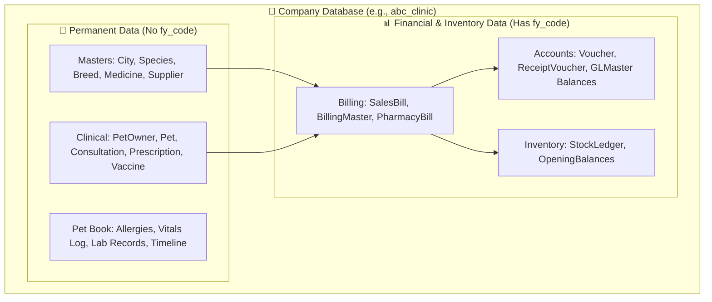
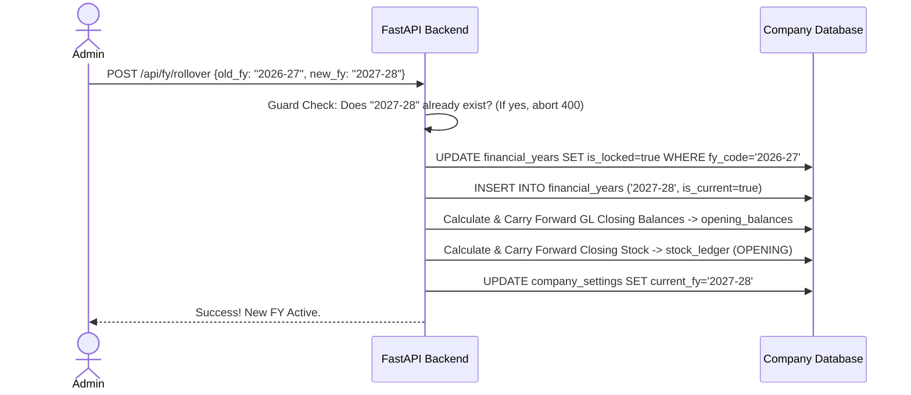

# 🐾 Pet Clinic ERP — Updated Execution Plan V2 (Secured & Hardened)
**Master DB + Company DBs | Role-Based Access Control (RBAC) | FY-Aware Financials | Pet Book**

---

## 1. Executive Summary & Architectural Evaluation

### 1.1 Critique of `PET_ERP_UPDATED_PLAN_V2.md`
The architectural strategy proposed in `PET_ERP_UPDATED_PLAN_V2.md` is **exceptional, highly scalable, and production-grade**. It perfectly resolves the critical flaws identified in earlier iterations while maintaining robust financial isolation.

* **✅ Master DB Separation (`pet_erp_master`):** By isolating tenant profiles, user credentials, and company routing into a dedicated 4th database, the system achieves true multi-tenancy. Authentication is lightning fast, and cross-company access management becomes elegant and centralized.
* **✅ Unified Clinical History (Pet Book):** By maintaining a permanent, non-expiring database per company (`abc_clinic`, `bcd_clinic`), clinical records (`pets`, `pet_owners`, `consultations`, `vaccines`) remain continuous over the pet's 10–15 year lifespan. Doctors never have to switch databases to view past medical history.
* **✅ FY-Aware Financials (`fy_code` Stamping):** Restricting financial year partitioning to a `fy_code` column on transactional financial tables (`billing`, `vouchers`, `stock_ledger`) provides flawless accounting rollover capabilities without the massive operational overhead of creating new physical databases every April 1st.
* **✅ Dynamic RBAC:** The granular `user_module_access` and `user_company_access` schemas allow flexible, real-world clinic hierarchies (e.g., an owner with multi-branch Admin rights vs. a receptionist restricted to a single branch).

---

## 2. Comprehensive `fy_code` Table Mapping

To implement the FY-aware architecture, we must categorize all existing tables in the ERP into **Financial/Inventory Transactions (MUST receive `fy_code`)** and **Permanent Master/Clinical Data (MUST NOT receive `fy_code`)**.



### 2.1 Table-by-Table `fy_code` Classification

| Module / Model File | Table Name | Needs `fy_code`? | Rationale / Architectural Decision |
| :--- | :--- | :---: | :--- |
| `models/clinic.py` | `clinic_setup` / `company_settings` | ❌ | Local mirror of company profile; tracks `current_fy` as a setting. |
| `models/users.py` | `users`, `roles`, `access` | ❌ | Managed centrally in `pet_erp_master`. |
| `models/masters.py` | `cities`, `species`, `breeds`, `hsn_codes`, `gst_rates` | ❌ | Master reference data; permanent across all financial years. |
| `models/people.py` | `pet_owners`, `pets` | ❌ | Client and Patient masters; must be permanent for continuous history. |
| `models/doctors.py` | `doctors`, `staff` | ❌ | Employee master records; permanent. |
| `models/agents.py` | `agents` | ❌ | Commission agent master records; permanent. |
| `models/stage3.py` | `units`, `medicines`, `procedures`, `vaccines` | ❌ | Catalog master data; permanent. |
| `models/stage3.py` | `medicine_batches` | ❌ | Batches are created via purchase bills but remain active across FYs until depleted/expired. |
| `models/stage3.py` | `stock_ledger` | ✅ **YES** | Every inventory IN/OUT movement is strictly tied to an FY for stock valuation. |
| `models/stage3.py` | `sales_bills`, `sales_bill_items` | ✅ **YES** | Transactional counter sales; must be partitioned by FY for tax reporting. |
| `models/phase2.py` | `doctor_schedule`, `appointments`, `consultations`, `consultation_procedures`, `prescriptions`, `prescription_items`, `vaccination_records`, `vaccination_reminders` | ❌ | Clinical transactions and history; forms the core of the permanent Pet Book. |
| `models/phase3.py` | `suppliers` | ❌ | Vendor master data; permanent. |
| `models/phase3.py` | `purchase_bills`, `purchase_bill_items` | ✅ **YES** | Supplier purchase invoices; tied to FY for expense and GST calculation. |
| `models/phase3.py` | `pharmacy_bills`, `pharmacy_bill_items` | ✅ **YES** | Counter pharmacy sales; tied to FY for revenue tracking. |
| `models/phase4.py` | `gl_master` | ❌ | Chart of accounts master; permanent. (Opening balances tracked separately). |
| `models/phase4.py` | `billing_master`, `billing_items` | ✅ **YES** | Consolidated clinic invoices; tied to FY. |
| `models/phase4.py` | `receipt_vouchers`, `vouchers` | ✅ **YES** | Financial accounting journal/payment/receipt entries; tied to FY. |
| `models/phase4.py` *(New)* | `opening_balances` | ✅ **YES** | Tracks GL account opening balances per financial year. |

---

## 3. Backend Implementation Specification

### 3.1 Master DB Schemas (`pet_erp_master`)
Located in a new SQLAlchemy model file `backend/models/master_sys.py`.

> [!IMPORTANT]  
> **Security & Normalization Hardening:**
> 1. `db_uri` in `CompanyProfile` stores database connection strings containing credentials. These are **encrypted at rest** using `cryptography.fernet.Fernet` and decrypted dynamically in memory only when establishing a session.
> 2. The `roles` table is explicitly modeled in the Master DB. `UserCompanyAccess` references `role_id` via a Foreign Key instead of a plain string, ensuring role renaming propagates instantly without updating user access rows.

```python
from sqlalchemy import Column, Integer, String, Text, Boolean, ForeignKey, DateTime
from sqlalchemy.orm import relationship
from datetime import datetime
from database import Base

class Tenant(Base):
    __tablename__ = "tenants"
    tenant_id = Column(Integer, primary_key=True, index=True)
    tenant_name = Column(String(150), nullable=False)
    email = Column(String(100), unique=True, nullable=False)
    password_hash = Column(Text, nullable=False)
    created_at = Column(DateTime, default=datetime.utcnow)
    companies = relationship("CompanyProfile", back_populates="tenant")

class CompanyProfile(Base):
    __tablename__ = "company_profiles"
    company_id = Column(Integer, primary_key=True, index=True)
    tenant_id = Column(Integer, ForeignKey("tenants.tenant_id"))
    company_code = Column(String(10), nullable=False) # ABC, BCD
    company_name = Column(String(200), nullable=False)
    db_name = Column(String(100), nullable=False)
    
    # ENCRYPTED AT REST: Connection string containing DB password
    db_uri = Column(Text, nullable=False) 
    
    address_line1 = Column(String(200))
    city = Column(String(100))
    state = Column(String(100))
    pincode = Column(String(10))
    gst_number = Column(String(20))
    pan_number = Column(String(20))
    drug_license_no = Column(String(50))
    logo_url = Column(Text)
    current_fy = Column(String(10), default="2026-27")
    fy_start_month = Column(Integer, default=4)
    status = Column(String(20), default="Active")
    created_at = Column(DateTime, default=datetime.utcnow)
    tenant = relationship("Tenant", back_populates="companies")

class MasterUser(Base):
    __tablename__ = "users"
    user_id = Column(Integer, primary_key=True, index=True)
    tenant_id = Column(Integer, ForeignKey("tenants.tenant_id"))
    full_name = Column(String(150), nullable=False)
    email = Column(String(100), unique=True, nullable=False)
    password_hash = Column(Text, nullable=False)
    phone = Column(String(15))
    is_active = Column(Boolean, default=True)
    created_at = Column(DateTime, default=datetime.utcnow)

class Role(Base):
    __tablename__ = "roles"
    role_id = Column(Integer, primary_key=True, index=True)
    company_id = Column(Integer, ForeignKey("company_profiles.company_id"))
    role_name = Column(String(50), nullable=False) # Admin, Doctor, Receptionist, Pharmacist
    is_system = Column(Boolean, default=False) # System roles cannot be deleted

class UserCompanyAccess(Base):
    __tablename__ = "user_company_access"
    access_id = Column(Integer, primary_key=True, index=True)
    user_id = Column(Integer, ForeignKey("users.user_id"))
    company_id = Column(Integer, ForeignKey("company_profiles.company_id"))
    
    # NORMALIZED FOREIGN KEY: References Role ID, not plain text string
    role_id = Column(Integer, ForeignKey("roles.role_id"), nullable=False) 
    is_active = Column(Boolean, default=True)

class UserModuleAccess(Base):
    __tablename__ = "user_module_access"
    module_access_id = Column(Integer, primary_key=True, index=True)
    user_id = Column(Integer, ForeignKey("users.user_id"))
    company_id = Column(Integer, ForeignKey("company_profiles.company_id"))
    module_code = Column(String(50), nullable=False)
    can_view = Column(Boolean, default=True)
    can_create = Column(Boolean, default=False)
    can_edit = Column(Boolean, default=False)
    can_delete = Column(Boolean, default=False)
    can_export = Column(Boolean, default=False)
```

---

### 3.2 Company DB Financial Models (`fy_code` Stamping)
Example updates to `backend/models/stage3.py`, `phase3.py`, and `phase4.py`.

> [!IMPORTANT]  
> **Database-Level Duplicate Protection:**
> A `UniqueConstraint` on `(fy_code, gl_id)` is enforced on `OpeningBalance` to act as an uncompromisable database guard against duplicate End-of-Year rollover runs.

```python
from sqlalchemy import Column, Integer, String, Numeric, ForeignKey, DateTime, Date, Boolean, Index, UniqueConstraint
from datetime import datetime
from database import Base

class FinancialYear(Base):
    __tablename__ = "financial_years"
    fy_id = Column(Integer, primary_key=True, index=True)
    fy_code = Column(String(10), unique=True, nullable=False) # '2026-27'
    start_date = Column(Date, nullable=False)
    end_date = Column(Date, nullable=False)
    is_current = Column(Boolean, default=False)
    is_locked = Column(Boolean, default=False)
    locked_at = Column(DateTime)
    locked_by = Column(Integer)

class StockLedger(Base):
    __tablename__ = "stock_ledger"
    ledger_id = Column(Integer, primary_key=True, index=True)
    fy_code = Column(String(10), ForeignKey("financial_years.fy_code"), nullable=False, index=True)
    medicine_id = Column(Integer, ForeignKey("medicines.medicine_id"), nullable=False)
    batch_id = Column(Integer, ForeignKey("medicine_batches.batch_id"), nullable=False)
    txn_type = Column(String(20), nullable=False) # PURCHASE, SALE, OPENING, ADJUSTMENT
    txn_date = Column(Date, nullable=False)
    qty = Column(Numeric(10,3), nullable=False)
    unit_price = Column(Numeric(10,2), nullable=False)
    created_at = Column(DateTime, default=datetime.utcnow)
    
    # Composite index for high-performance FY filtering
    __table_args__ = (Index('idx_stock_fy_date', 'fy_code', 'txn_date'),)

class Voucher(Base):
    __tablename__ = "vouchers"
    voucher_id = Column(Integer, primary_key=True, index=True)
    fy_code = Column(String(10), ForeignKey("financial_years.fy_code"), nullable=False, index=True)
    voucher_no = Column(String(50), unique=True, nullable=False) # e.g., VCH/2026-27/0001
    voucher_type = Column(String(20), nullable=False) # RECEIPT, PAYMENT, JOURNAL
    voucher_date = Column(Date, nullable=False)
    debit_gl = Column(Integer, ForeignKey("gl_master.gl_id"))
    credit_gl = Column(Integer, ForeignKey("gl_master.gl_id"))
    amount = Column(Numeric(12,2), nullable=False)
    narration = Column(Text)
    created_at = Column(DateTime, default=datetime.utcnow)
    
    __table_args__ = (Index('idx_voucher_fy_date', 'fy_code', 'voucher_date'),)

class OpeningBalance(Base):
    __tablename__ = "opening_balances"
    ob_id = Column(Integer, primary_key=True, index=True)
    fy_code = Column(String(10), ForeignKey("financial_years.fy_code"), nullable=False, index=True)
    gl_id = Column(Integer, ForeignKey("gl_master.gl_id"), nullable=False)
    amount = Column(Numeric(14,2), default=0)
    balance_type = Column(String(2), default="DR") # DR or CR

    # DATABASE GUARD: Prevents duplicate opening balances if EOY rollover runs twice
    __table_args__ = (UniqueConstraint('fy_code', 'gl_id', name='uq_ob_fy_gl'),)
```

---

### 3.3 Dynamic Session & Automatic Stamping (FastAPI Dependencies)

```python
# backend/dependencies.py
import os
import jwt
from fastapi import Request, HTTPException, Depends
from sqlalchemy.orm import Session
from cryptography.fernet import Fernet
from database import get_engine_for_db # LRU cached engine retrieval

# SECURITY HARDENING: Load JWT Secret from environment variables
SECRET_KEY = os.environ.get("JWT_SECRET_KEY")
if not SECRET_KEY:
    raise RuntimeError("FATAL: JWT_SECRET_KEY environment variable not set in .env")

# SECURITY HARDENING: Fernet cipher for decrypting DB URIs at rest
FERNET_KEY = os.environ.get("DB_ENCRYPTION_KEY")
if not FERNET_KEY:
    raise RuntimeError("FATAL: DB_ENCRYPTION_KEY environment variable not set in .env")
cipher_suite = Fernet(FERNET_KEY.encode())

def get_current_user_token(request: Request):
    auth_header = request.headers.get("Authorization")
    if not auth_header or not auth_header.startswith("Bearer "):
        raise HTTPException(status_code=401, detail="Missing or invalid token")
    token = auth_header.split(" ")[1]
    try:
        payload = jwt.decode(token, SECRET_KEY, algorithms=["HS256"])
        return payload
    except jwt.PyJWTError:
        raise HTTPException(status_code=401, detail="Token expired or invalid")

def get_company_db_session(token: dict = Depends(get_current_user_token)):
    """Yields a database session connected to the specific company DB"""
    encrypted_db_uri = token.get("db_uri")
    if not encrypted_db_uri:
        raise HTTPException(status_code=400, detail="Token missing company DB routing info")
        
    # Decrypt DB URI in memory dynamically
    try:
        db_uri = cipher_suite.decrypt(encrypted_db_uri.encode()).decode()
    except Exception:
        raise HTTPException(status_code=500, detail="Failed to decrypt database credentials")

    engine = get_engine_for_db(db_uri)
    SessionLocal = sessionmaker(bind=engine)
    db = SessionLocal()
    try:
        # Inject active FY code into session context for automatic stamping
        db.info['active_fy_code'] = token.get("fy", "2026-27")
        db.info['current_user_id'] = token.get("user_id")
        yield db
    finally:
        db.close()

def enforce_module_access(module_code: str, action: str):
    """RBAC Middleware Dependency"""
    def _enforce(token: dict = Depends(get_current_user_token)):
        allowed_modules = token.get("allowed_modules", {})
        if module_code not in allowed_modules:
            raise HTTPException(status_code=403, detail=f"No access to module: {module_code}")
        perms = allowed_modules[module_code] # e.g., {'view': True, 'create': False}
        if not perms.get(action, False):
            raise HTTPException(status_code=403, detail=f"Permission denied: cannot {action} {module_code}")
        return token
    return _enforce
```

#### 🔄 Automatic Stamping via SQLAlchemy Events
To ensure developers never forget to pass `fy_code`, we attach a SQLAlchemy event listener that automatically populates `fy_code` on insert:

```python
from sqlalchemy import event
from sqlalchemy.orm import Session
from models.stage3 import StockLedger, SalesBill
from models.phase3 import PurchaseBill, PharmacyBill
from models.phase4 import Voucher, BillingMaster

# List of all financial models requiring fy_code stamping
FY_MODELS = [StockLedger, SalesBill, PurchaseBill, PharmacyBill, Voucher, BillingMaster]

def assign_active_fy_code(mapper, connection, target):
    session = Session.object_session(target)
    if session and 'active_fy_code' in session.info:
        if not getattr(target, 'fy_code', None):
            target.fy_code = session.info['active_fy_code']

for model in FY_MODELS:
    event.listens_for(model, 'before_insert')(assign_active_fy_code)
```

---

## 4. End of Year (EOY) Rollover Specification

When the financial year ends (e.g., on March 31, 2027), the Admin navigates to `Company Settings -> Financial Years` and clicks **"Close FY 2026-27 & Open FY 2027-28"**.



### 4.1 API & SQL Execution Logic (Inside Company DB)

> [!WARNING]  
> **Idempotency Guard at API Level:**
> Before executing the rollover transaction, the API verifies if the target financial year already exists to prevent duplicate execution from network retries or double clicks.

```python
# FastAPI Route Endpoint for EOY Rollover
@router.post("/api/fy/rollover")
def execute_eoy_rollover(payload: RolloverPayload, db: Session = Depends(get_company_db_session)):
    new_fy = payload.new_fy
    old_fy = payload.old_fy

    # API-LEVEL GUARD: Prevent duplicate execution
    existing = db.query(FinancialYear).filter_by(fy_code=new_fy).first()
    if existing:
        raise HTTPException(
            status_code=400, 
            detail=f"Financial year {new_fy} already exists. Rollover already completed."
        )

    # Execute ACID Rollover SQL Transaction
    try:
        db.execute(ROLLOVER_SQL_SCRIPT, {"old_fy": old_fy, "new_fy": new_fy, "user_id": db.info['current_user_id']})
        db.commit()
    except IntegrityError as e:
        db.rollback()
        raise HTTPException(status_code=400, detail="Rollover failed due to database constraint violation (duplicate opening balances).")
    except Exception as e:
        db.rollback()
        raise HTTPException(status_code=500, detail=f"Rollover failed: {str(e)}")

    return {"status": "success", "message": f"Successfully rolled over to {new_fy}"}
```

#### Exact SQL Execution Script (`ROLLOVER_SQL_SCRIPT`)

```sql
BEGIN TRANSACTION;

-- Step 1: Lock the old Financial Year
UPDATE financial_years 
SET is_locked = TRUE, is_current = FALSE, locked_at = NOW(), locked_by = :user_id
WHERE fy_code = :old_fy;

-- Step 2: Create the new Financial Year
INSERT INTO financial_years (fy_code, start_date, end_date, is_current, is_locked)
VALUES (:new_fy, '2027-04-01', '2028-03-31', TRUE, FALSE);

-- Step 3: Carry forward General Ledger closing balances as opening balances
-- Note: uq_ob_fy_gl unique constraint prevents duplicate inserts if run twice
INSERT INTO opening_balances (fy_code, gl_id, amount, balance_type)
SELECT 
    :new_fy,
    gl_id, 
    ABS(SUM(CASE WHEN balance_type = 'DR' THEN amount ELSE -amount END)),
    CASE WHEN SUM(CASE WHEN balance_type = 'DR' THEN amount ELSE -amount END) >= 0 THEN 'DR' ELSE 'CR' END
FROM (
    SELECT gl_id, opening_balance as amount, balance_type FROM gl_master
    UNION ALL
    SELECT debit_gl as gl_id, amount, 'DR' as balance_type FROM vouchers WHERE fy_code = :old_fy
    UNION ALL
    SELECT credit_gl as gl_id, amount, 'CR' as balance_type FROM vouchers WHERE fy_code = :old_fy
) account_summary
GROUP BY gl_id;

-- Step 4: Carry forward inventory closing stock as opening stock
INSERT INTO stock_ledger (fy_code, medicine_id, batch_id, txn_type, txn_date, qty, unit_price)
SELECT 
    :new_fy,
    medicine_id,
    batch_id,
    'OPENING',
    '2027-04-01',
    SUM(CASE WHEN txn_type IN ('PURCHASE', 'OPENING', 'ADJUSTMENT_IN') THEN qty ELSE -qty END) as closing_qty,
    AVG(unit_price)
FROM stock_ledger 
WHERE fy_code = :old_fy
GROUP BY medicine_id, batch_id
HAVING SUM(CASE WHEN txn_type IN ('PURCHASE', 'OPENING', 'ADJUSTMENT_IN') THEN qty ELSE -qty END) > 0;

-- Step 5: Update local company settings mirror
UPDATE company_settings SET current_fy = :new_fy;

COMMIT;
```

---

## 5. Step-by-Step Execution Roadmap

```
┌───────────────────────────────────────────────────────────────────────────┐
│              PROJECT EXECUTION ROADMAP V2 (SECURED & HARDENED)            │
└───────────────────────────────────────────────────────────────────────────┘
       │
       ├─► PHASE 1: Master DB & Company Automation (Weeks 1-2)
       │     ├── 1.1 Initialize pet_erp_master DB & create master_sys.py models
       │     ├── 1.2 Implement Fernet DB URI encryption/decryption utilities
       │     ├── 1.3 Create Alembic migration template for Company DB schema
       │     ├── 1.4 Implement POST /api/companies endpoint (Auto DB creation)
       │     └── 1.5 Build Frontend Company Management & Onboarding UI
       │
       ├─► PHASE 2: Dynamic RBAC & Authentication (Weeks 3-4)
       │     ├── 2.1 Implement Master Login API with Company Selector
       │     ├── 2.2 Build JWT Generator embedding DB routing, FY, and Module Perms
       │     ├── 2.3 Create FastAPI dependency middleware (enforce_module_access)
       │     └── 2.4 Build Frontend Dynamic Navigation & Role Assignment Admin UI
       │
       ├─► PHASE 3: FY-Aware Financials & Rollover (Weeks 5-6)
       │     ├── 3.1 Update Stage3, Phase3, Phase4 models with fy_code & indices
       │     ├── 3.2 Implement SQLAlchemy before_insert automatic stamping event
       │     ├── 3.3 Build FY-aware invoice numbering generator (e.g. INV/26-27/001)
       │     └── 3.4 Implement POST /api/fy/rollover EOY close transaction API (with Guards)
       │
       └─► PHASE 4: Permanent Pet Book Dashboard (Weeks 7-8)
             ├── 4.1 Create Pet Book models (Allergies, Vitals, Labs, Timeline)
             ├── 4.2 Implement SQLAlchemy after_insert event listeners for Timeline
             ├── 4.3 Build Frontend PetBook.jsx (Glassmorphism, Recharts, Timeline)
             └── 4.4 Implement Pet Passport PDF Export (jsPDF / ReportLab)
```

---

## 6. Verification & Testing Plan

### 6.1 Automated Test Cases
1. **Multi-Company Isolation Test:** Log in as User A (Tenant 1, Company ABC). Attempt to access Company BCD's database engine directly or via modified JWT claims. Verify `403 Forbidden`.
2. **RBAC Enforcement Test:** Log in as Receptionist (view-only billing). Attempt to send `POST /api/billing/pay`. Verify `403 Permission Denied`.
3. **FY Isolation & Stamping Test:** Create a Sales Bill without passing `fy_code`. Verify SQLAlchemy event automatically injects active session `fy_code`. Query `SalesBill` with `fy_code='2025-26'` and verify it excludes `2026-27` records.
4. **EOY Rollover Idempotency Test:** Execute EOY Rollover API twice for the same FY. Verify second call fails gracefully with `400 Financial year already exists` and prevents duplicate opening balance entries.
5. **Continuous Pet History Test:** Query a pet's timeline across multiple financial years. Verify all consultations, vaccines, and lab results from FY25, FY26, and FY27 appear seamlessly in a single chronological array.
6. **Environment Security Test:** Remove `JWT_SECRET_KEY` or `DB_ENCRYPTION_KEY` from `.env` and restart backend. Verify application aborts immediately with `RuntimeError`.
